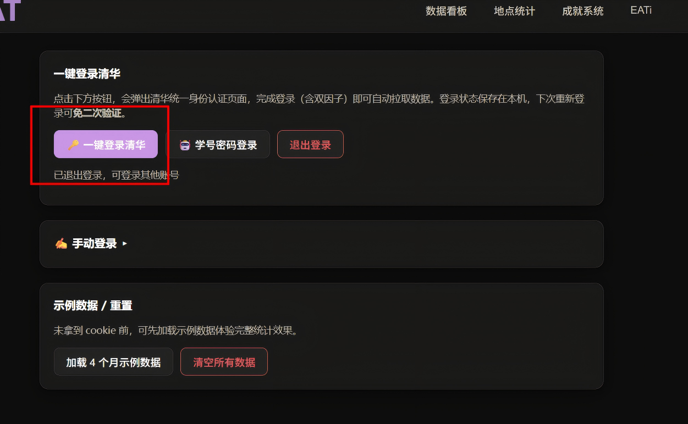
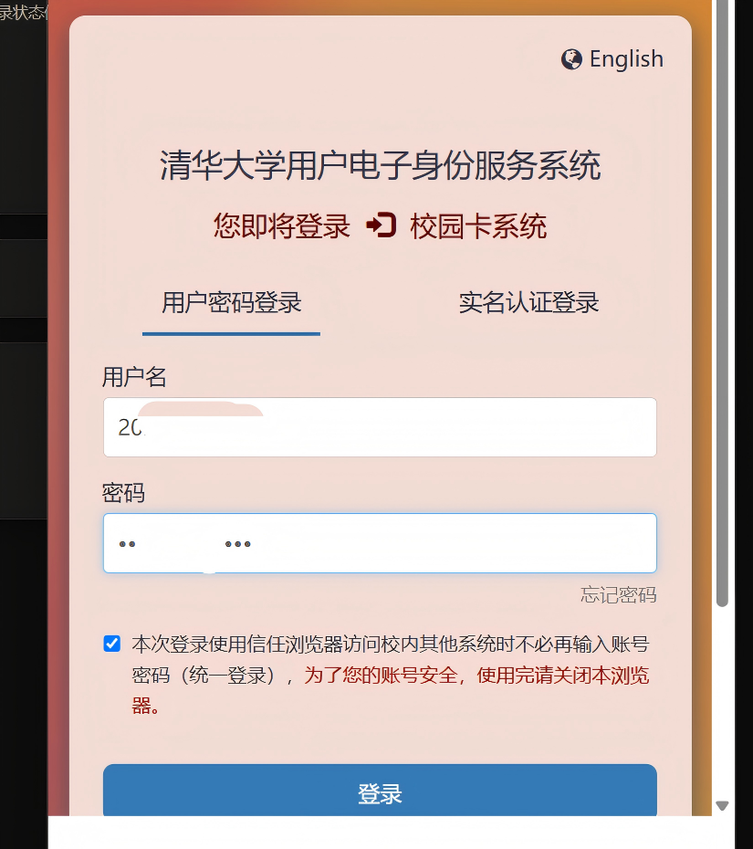

# 🍜 THU Eat — 清华校园卡消费统计

把你在食堂刷卡吃饭的记录，自动变成统计图表。能看到花了多少钱、最爱去哪个食堂、解锁多少成就勋章。

**数据全程留在你电脑上，不上传任何地方。**

> 💡 **彩蛋提示**：程序里藏了不少隐藏功能和惊喜，多点点各处按钮、多切切页面——你可能会发现一些意想不到的东西。

---

## 💭 为什么做这个

最开始只是想给自己做一个记账工具，方便统计在食堂的消费。做着做着发现——光看数字不过瘾，于是加了可视化图表；图表看多了又觉得少了点乐子，于是加了成就勋章、EATi 人格、食堂探索……最后就变成了现在这个 THU Eat。

下一步希望把它做成一个**类似选课社区的美食分享平台**：每个人不仅能看自己的数据，还能分享食堂窗口点评、推荐隐藏好菜、一起完善校内外美食地图。如果你有什么想法或建议，欢迎来 [Issues](https://github.com/user-A100/THU-EAT/issues) 聊，或者直接加 QQ 群 **1057549311**。

---

## ✨ 功能

### 数据看板
总支出、本月/今日/本周/本年支出、笔均消费、活跃天数、最大单笔。消费趋势柱状图（日/周/月/年）、分类占比饼图、日历热力图。


### 成就勋章 & EATi 个性画像
消费额度、频次、食堂广度、窗口忠诚度、早起鸟、夜猫子等 **16 种可升级勋章**。基于你的消费习惯生成专属 **EATi 吃货人格**（共 21 种）。


### 地点统计
窗口 / 食堂双模式切换，按金额/笔数/笔均排序，搜索筛选，看你最爱去哪吃。


### 消费明细 & 导出
分页浏览、关键词搜索、分类筛选。一键导出 CSV，Excel 直接打开。

### 数据同步
一键从校园卡系统拉取真实数据，按 id 去重。支持增量同步、自动定时同步。

### 体验
深浅色自动跟随系统、响应式布局、多人共用数据隔离。

---

## 🪟 Windows 用户请看这里（最简单）

> 💡 **启动速度提示**：`THUeat.exe` 每次启动都要解压内置文件，**比较慢**（黑窗口会停一会儿才弹出页面）。如果你会装 Python、能用命令行，推荐走 **`start.bat`** 那条路，**快很多**：
> 1. 安装 [Python 3.8+](https://www.python.org/downloads/)（安装时勾选 **Add Python to PATH**）
> 2. 下载本仓库源码：`git clone https://github.com/user-A100/THU-EAT.git`（或网页上点绿色 `Code` → `Download ZIP` 解压）
> 3. 进入文件夹，双击 `start.bat`（首次会自动安装依赖，之后就秒开）

### 第一步：下载

去右侧 [Releases](https://github.com/user-A100/THU-EAT/releases) → 下载 `THUeat.exe`

### 第二步：双击打开

双击 `THUeat.exe`，会弹出一个黑窗口（不要关），然后浏览器自动打开一个页面。

### 第三步：加载示例数据

刚打开是空的。点击头像进入「**配置与同步**」→ 点「**加载示例数据**」→ 回到「数据看板」，就能看到效果了。

### 以后想用了

再双击 `THUeat.exe` 就行。（需要自己重新同步数据）

---

## 🍎 Mac 用户请看这里

### 第一步：装 Python

1. 打开 https://www.python.org/downloads/
2. 下载安装Python

### 第二步：下载代码

按 `Command + 空格`，输入 `终端`，回车打开终端。在终端里依次输入以下命令（每输完一行按回车）：

```bash
git clone https://github.com/user-A100/THU-EAT.git
```

> 如果提示 `command not found: git`，先去 https://git-scm.com/downloads/mac 下载安装 git

```bash
cd THU-EAT
pip3 install -r requirements.txt
python3 app.py
```

最后一行出现 `THUeat 已启动` 就说明成功了，浏览器会自动打开。

### 第三步：加载示例数据

点左边「**配置与同步**」→「**加载示例数据**」→ 回到「数据看板」。

---

## 🐧 Linux 用户请看这里

打开终端，依次输入：

```bash
git clone https://github.com/user-A100/THU-EAT.git
cd THU-EAT
pip install -r requirements.txt
python3 app.py
```

浏览器自动打开 → 点「配置与同步」→「加载示例数据」。

---

## 📥 怎么同步你自己的真实数据

上面的示例数据是假的。想看你自己的真实刷卡记录，登录一次即可，程序会自动拉取。

### 方式一：清华一键登录（推荐）

1. 点头像进入「**配置与同步**」→ 点「**🔑 一键登录清华**」
2. 在弹出的清华统一身份认证（SSO）窗口中，完成身份验证（学号 + 密码 + 双因子验证）



3. **⚠️ 千万不要自己关掉登录窗口！** 等待窗口**自动退出**——数据获取完毕后系统会自动关闭它



4. 回到页面，点击「**全部导入**」即可拉取你的真实消费数据

> 就是这么简单：**点按钮 → 弹窗验证 → 等窗口自己关 → 点全部导入**，三步搞定。
>
> **最重要的一点：别手贱关窗口！** 登录完成后系统会自动捕获会话并关闭窗口，手动关闭会导致拿不到数据。
>
> 登录状态会保存在你电脑上。下次需要重新同步时再点「一键登录清华」，**通常可免二次验证**（浏览器已被清华 SSO 记为可信设备），窗口一闪就自动关，几秒就搞定。
>
> 不想弹浏览器填验证码？也可以用「**🤖 学号密码登录**」：填学号和密码，程序在后台自动登录（已在本机登录过的情况下同样可免二次验证）。密码仅在本次登录使用，不会保存。

### 方式二：手动复制 Cookie（备用）

如果一键登录在你的环境不可用（部分 Mac / Linux、或缺少浏览器运行库），可手动复制 cookie：

1. 用电脑浏览器打开 **https://card.tsinghua.edu.cn/** ，登录校园卡（学号+密码+双因子验证）
2. 登录成功后，按 **F12**（Mac 按 `Command + Option + I`）
3. 点顶部的 **Application**（应用程序）标签
4. 左侧找到 **Cookies** → 点开 → 点 `card.tsinghua.edu.cn`
5. 右边列表里找到 **`servicehall`** 这一行 → 双击它的 **Value** → 全选复制


然后回到「**配置与同步**」→ 把 servicehall 值粘贴到「servicehall Cookie（备用）」输入框 → 填上学号 → 点「**保存配置**」→ 再点「**全部导入**」或「**近一年**」。


> servicehall 过几个小时会过期。过期后再同步会报错，重新登录（或重新粘贴）即可，本地数据不会丢。
>
> 🔧 想了解一键登录的技术实现细节？见 [SSO登录说明.md](./SSO登录说明.md)。

---

## ❓ 常见问题

**Q：黑窗口能关吗？**
A：关了程序就停了。不用的时候再关。

**Q：图标/图表缩成一团、排版乱了？**
A：偶尔图表在容器尺寸还没算好时就先渲染了，会挤在一起。刷新一下页面（按 F5）就恢复正常。

**Q：同步报错"cookie 已过期"？**
A：Cookie 过期了。点「🔑 一键登录清华」→ 弹窗验证 → 等窗口自动关闭 → 点「全部导入」即可（通常免二次验证，几秒就好）；或重新去 card.tsinghua.edu.cn 登录复制新的 Cookie 粘贴进去。

**Q：Mac / Linux 上能用一键登录吗？**
A：能。点「一键登录清华」会弹出浏览器完成统一身份认证。若你的环境缺少浏览器运行库导致弹窗失败，首次运行会自动尝试安装 Chromium；装不上时可改用「手动复制 Cookie」。

**Q：数据会传到网上吗？**
A：不会。所有数据存你电脑 `data/` 文件夹里，不联网。

**Q：分类不对怎么办？**
A：点「分类规则」→ 可以自己添加/删除关键词 → 点「用最新规则重新分类全部数据」。

**Q：想整个清空重来？**
A：「配置与同步」→「清空所有数据」。

---

## ⚖️ 合规说明

本程序用于查询**你自己**的校园卡消费记录，属于合理个人用途。请不要用于获取他人数据。

---

## 📄 License

MIT
