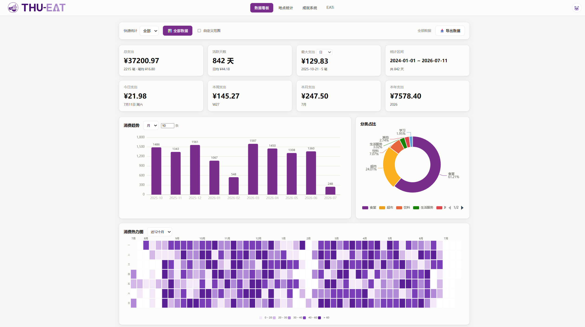
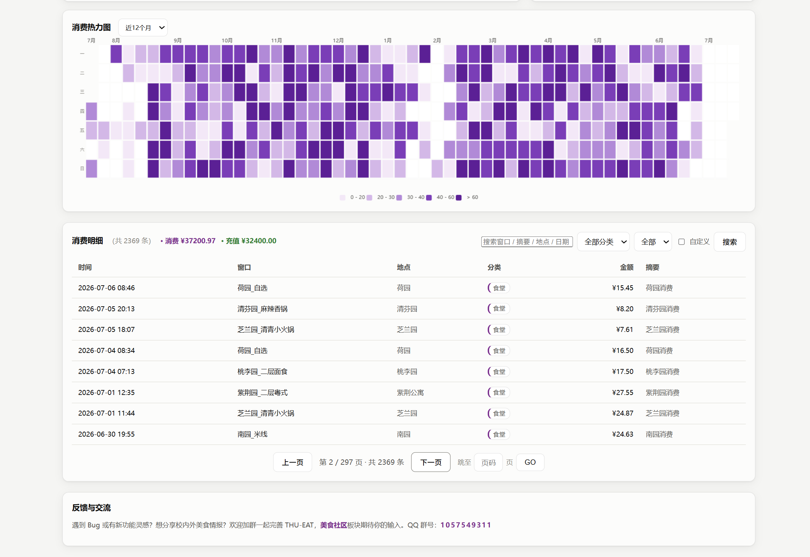
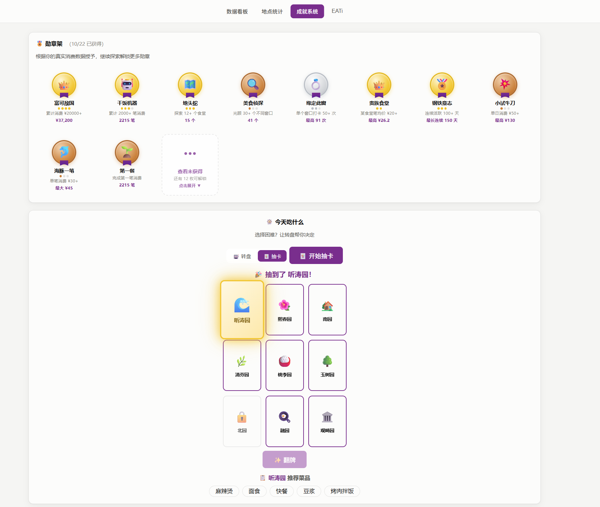
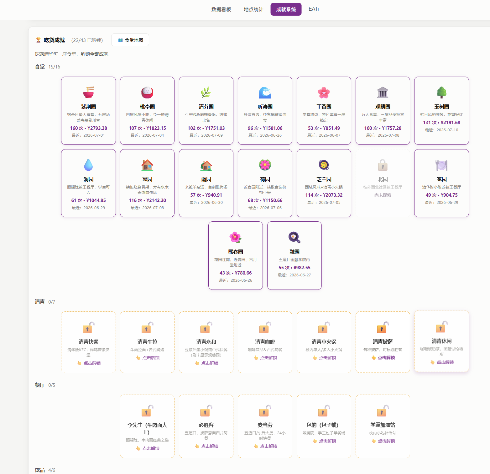
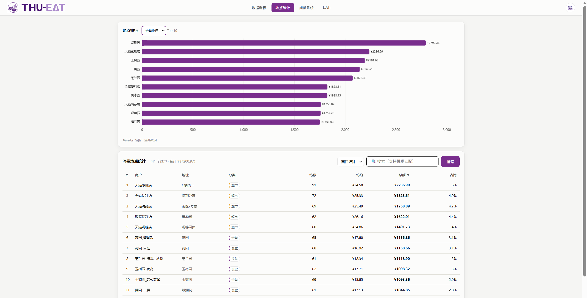
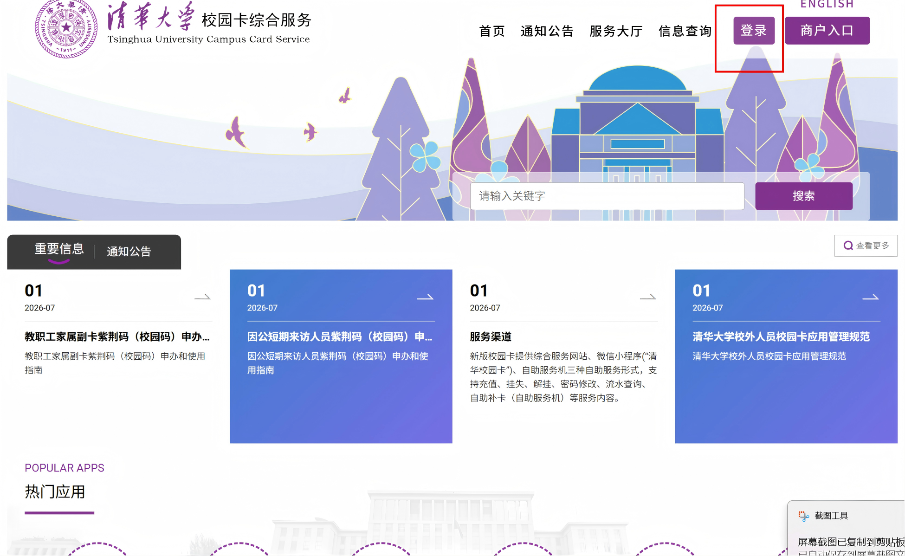
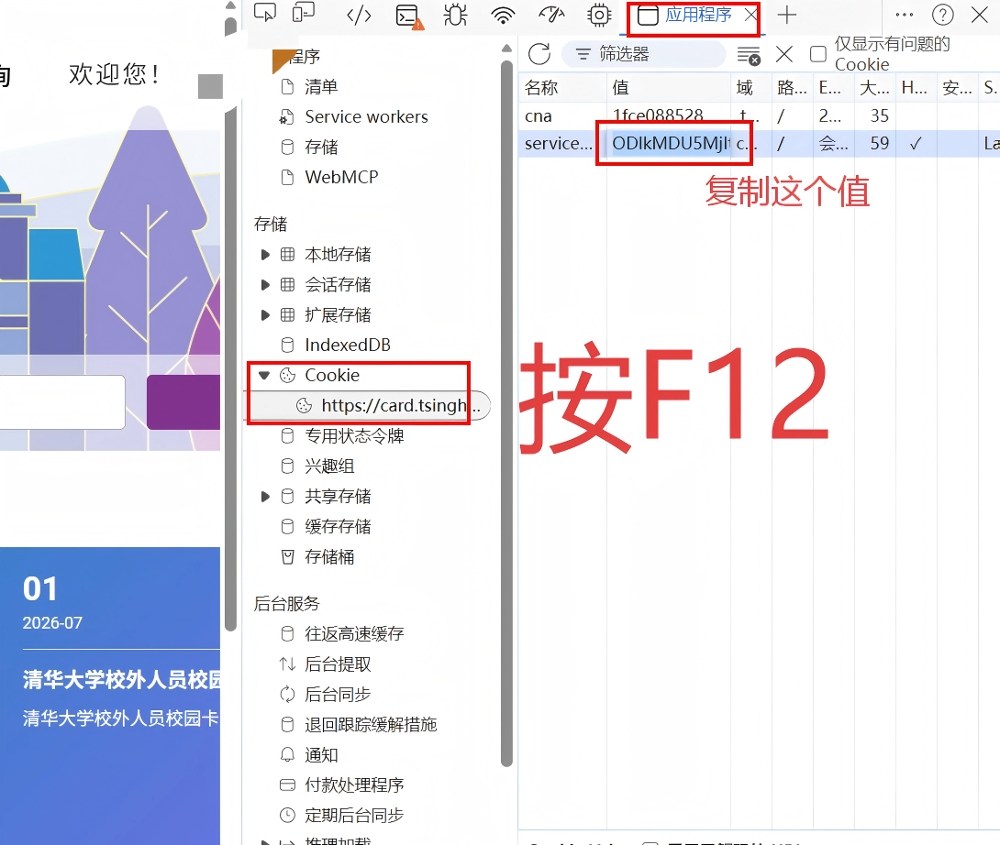
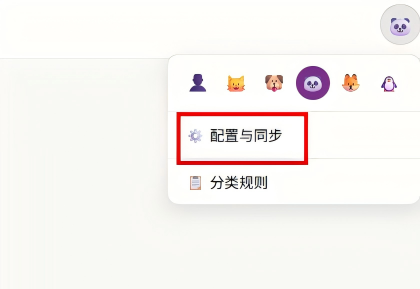
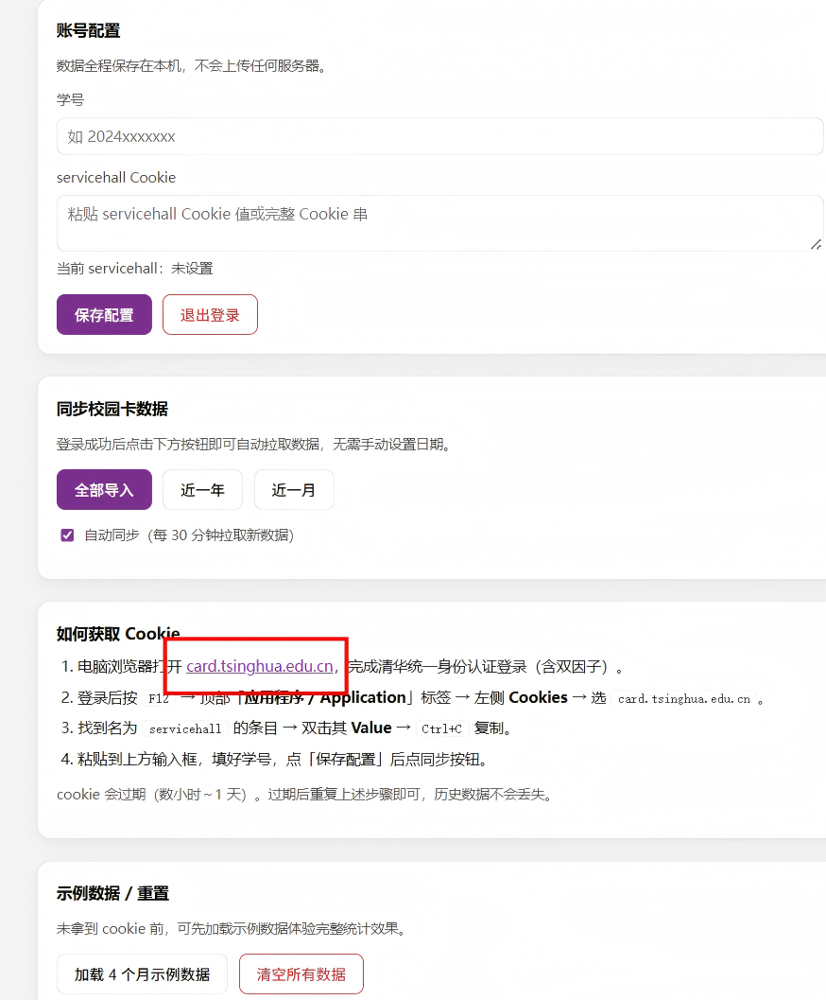
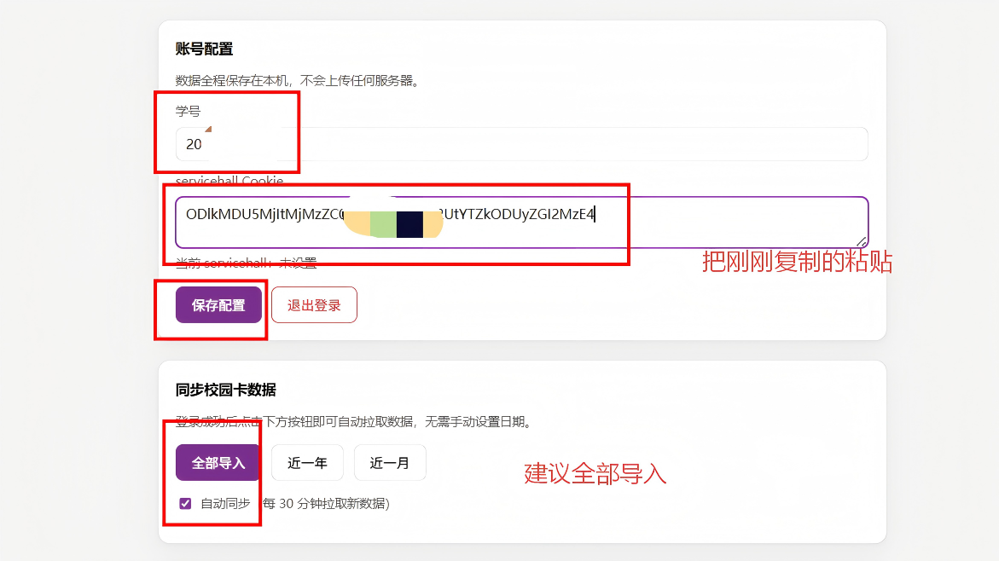

# 🍜 THU Eat — 清华校园卡消费统计

把你在食堂刷卡吃饭的记录，自动变成统计图表。能看到花了多少钱、最爱去哪个食堂、解锁多少成就勋章。

**数据全程留在你电脑上，不上传任何地方。**

---

## ✨ 功能

### 数据看板
总支出、本月/今日/本周/本年支出、笔均消费、活跃天数、最大单笔。消费趋势柱状图（日/周/月/年）、分类占比饼图、日历热力图。




### 成就勋章 & EATi 个性画像
消费额度、频次、食堂广度、窗口忠诚度、早起鸟、夜猫子等 **16 种可升级勋章**。基于你的消费习惯生成专属 **EATi 吃货人格**（共 21 种）。





### 地点统计
窗口 / 食堂双模式切换，按金额/笔数/笔均排序，搜索筛选，看你最爱去哪吃。



### 消费明细 & 导出
分页浏览、关键词搜索、分类筛选。一键导出 CSV，Excel 直接打开。

### 数据同步
一键从校园卡系统拉取真实数据，按 id 去重。支持增量同步、自动定时同步。

### 体验
深浅色自动跟随系统、响应式布局、多人共用数据隔离。

---

## 🪟 Windows 用户请看这里（最简单）

### 第一步：下载

去右侧 [Releases](https://github.com/user-A100/THU-EAT/releases) → 下载 `EatStat.exe`

### 第二步：双击打开

双击 `EatStat.exe`，会弹出一个黑窗口（不要关），然后浏览器自动打开一个页面。

### 第三步：加载示例数据

刚打开是空的。点击头像进入「**配置与同步**」→ 点「**加载示例数据**」→ 回到「数据看板」，就能看到效果了。

### 以后想用了

再双击 `EatStat.exe` 就行。（需要自己重新同步数据）

---

## 🍎 Mac 用户请看这里

### 第一步：装 Python

1. 打开 https://www.python.org/downloads/
2. 下载安装Python

### 第二步：下载代码

按 `Command + 空格`，输入 `终端`，回车打开终端。在终端里依次输入以下命令（每输完一行按回车）：

```bash
git clone https://github.com/user-A100/THU-EAT.git
```

> 如果提示 `command not found: git`，先去 https://git-scm.com/downloads/mac 下载安装 git

```bash
cd THU-EAT
pip3 install -r requirements.txt
python3 app.py
```

最后一行出现 `Eat_stat 已启动` 就说明成功了，浏览器会自动打开。

### 第三步：加载示例数据

点左边「**配置与同步**」→「**加载示例数据**」→ 回到「数据看板」。

---

## 🐧 Linux 用户请看这里

打开终端，依次输入：

```bash
git clone https://github.com/user-A100/THU-EAT.git
cd THU-EAT
pip install -r requirements.txt
python3 app.py
```

浏览器自动打开 → 点「配置与同步」→「加载示例数据」。

---

## 📥 怎么同步你自己的真实数据

上面的示例数据是假的。想看你自己的真实刷卡记录，需要做一步额外操作，获取"Cookie" 。

### 1. 获取 servicehall

1. 用电脑浏览器打开 **https://card.tsinghua.edu.cn/** ，登录校园卡（学号+密码+双因子验证）
2. 登录成功后，按 **F12**（Mac 按 `Command + Option + I`）
3. 点顶部的 **Application**（应用程序）标签
4. 左侧找到 **Cookies** → 点开 → 点 `card.tsinghua.edu.cn`
5. 右边列表里找到 **`servicehall`** 这一行 → 双击它的 **Value** → 全选复制




### 2. 填到程序里

在程序页面点头像进入「**配置与同步**」→ 把刚复制的 servicehall 值粘贴到「Cookie」输入框 → 填上学号 → 点「**保存配置**」




### 3. 同步数据

点「**全部导入**」或「**近一年**」按钮 → 等待几秒 → 切到「数据看板」就能看到你的真实消费统计了。



> servicehall 过几个小时会过期。过期后再同步会报错，重新获取粘贴就行，本地数据不会丢。

---

## ❓ 常见问题

**Q：黑窗口能关吗？**
A：关了程序就停了。不用的时候再关。

**Q：同步报错"cookie 已过期"？**
A：Cookie 过期了，重新去 card.tsinghua.edu.cn 登录，复制新的 Cookie 粘贴进去。

**Q：Mac 上能用一键登录吗？**
A：一键登录没在 Mac 上测试过，可能不行。用"手动复制 Cookie"的方法，Mac 上百分百能用。

**Q：数据会传到网上吗？**
A：不会。所有数据存你电脑 `data/` 文件夹里，不联网。

**Q：分类不对怎么办？**
A：点「分类规则」→ 可以自己添加/删除关键词 → 点「用最新规则重新分类全部数据」。

**Q：想整个清空重来？**
A：「配置与同步」→「清空所有数据」。

---

## ⚖️ 合规说明

本程序用于查询**你自己**的校园卡消费记录，属于合理个人用途。请不要用于获取他人数据。

---

## 📄 License

MIT
